# ⭐book-mark
Mobile과 Tablet, 노트북을 바꿔가면서 쓰는 생활 속에   
각 기기에 있는 즐겨찾기를 공유하지 못하는 불편함을 해결하고자   
웹 서비스로 개발하였습니다.

<br>

- 해당 프로젝트의 Front-End 부분입니다.
- 개인 프로젝트
- 개발기간 : 2021.12

<br>

## ⚙Environment
- Vue CLi 4.5.13
- Vue 2.6.11

<br>

## 🛠Library
- axios
- vue-router
- vuex

<br>

## 🔩CDN
- bootstrap 5.1.3
- fonts.google (Noto Sans)

<br>

## 🗂프론트엔드 구조


<br>

## ✔특징
### 1. Vuex 사용
   - 컴포넌트 간에 props, emit을 이용하는 것은 데이터 상태관리가 복잡해지므로 Vuex 사용
``` javascript
// BookMark.vue
async bookmarkData() {
  if(this.$store.state.email != '') {
    const user = {
      email: this.$store.state.email,
    };
    // ..
  }
},

// 위와 같이 아래 함수에서도 발생
async createAddress() 
async deleteAddress(index) 
async editAddress(index)
async toggleStar(index) 
```
``` javascript
// MyPage.vue
<input type="email" class="form-control mypage-input" v-bind:value="$store.state.email" id="email" placeholder="email@abc.com" disabled>  // line 10

async updatePw() {
  // ..
  const user = { email: this.$store.state.email,
  // ..
},

// 위와 같이 아래 함수에서도 발생
async deleteAccount()
```
``` javascript
// NavBar.vue
 <template v-if="!$store.state.email">  // line 12
 <router-link to="/edit" class="nav-link"><strong class="text-all">{{ $store.state.email }}</strong></router-link>  // line 42
 
async loginForm() {
  // ..
  this.$store.commit('setLogin', userData.email);
  // ..
}

// 위와 같이 아래 함수에서도 발생
async logout()
```

<br>

### 2. slot 을 이용하여 모달창 재사용성 향상
``` html
<!-- ModalPage.vue -->
<!-- slot을 형식을 만들고 -->
<slot name="modal-btn">modal-btn</slot>
<slot class="modal-title" name="title">Modal Title</slot>
<div class="modal-body">
  <slot name="body1">Modal Body1</slot>
  <slot name="input1">Modal input1</slot>
  <slot name="body2">Modal Body2</slot>
  <slot name="input2">Modal input2</slot>
</div>
<div class="modal-footer">
  <slot name="modal-clost-btn">Modal-clost-btn</slot>
  <slot name="modal-submit-btn">modal-submit-btn</slot>
</div>
```
``` html
<!-- BookMark.vue -->
<!-- slot형식에 맞춰 모달 생성 -->
<modal-page>
  <button slot="modal-btn" class="fixed-bottom plus-btn" id="plus" data-bs-toggle="modal" data-bs-target="#exampleModal"></button>
  <h5 slot="title">추가할 이름과 주소를 입력하세요.</h5>
  <span slot="body1" class="modal-body1">이름</span>
  <input slot="input1" v-model="newName" type="text" class="form-control modal-input" required>
  <span slot="body2">주소</span>
  <textarea slot="input2" v-model="newAddress" class="form-control modal-input modal-ta" rows="2" required></textarea>
  <button slot="modal-clost-btn" v-on:click="clearModal" type="button" class="btn btn-outline-secondary" data-bs-dismiss="modal">닫기</button>
  <button slot="modal-submit-btn" type="button" class="btn btn-success" v-on:click="createAddress">추가</button>
</modal-page>
```
``` html
<!-- MyPage.vue -->
<!-- slot형식에 맞춰 모달 생성 -->
<modal-page>
  <button slot="modal-btn" v-on:click="updatePw" type="button" class="btn btn-outline-primary update-pw-btn" data-bs-toggle="modal" data-bs-target="#exampleModal">비밀번호 변경</button>
  <h5 slot="title">비밀번호를 입력해주세요.</h5>
  <span slot="body1" class="modal-body1">기존 비밀번호</span>
  <input slot="input1" v-model="pwBefore" type="password" class="form-control modal-input" required>
  <span slot="body2">변경할 비밀번호</span>
  <input slot="input2" v-model="pwAfter" type="password" class="form-control modal-input" required>
  <button slot="modal-clost-btn" v-on:click="clearModal" type="button" class="btn btn-outline-secondary" data-bs-dismiss="modal">닫기</button>
  <button slot="modal-submit-btn" v-bind:disabled="!isPwValid" type="button" class="btn btn-success" v-on:click="updatePw">변경</button>
</modal-page>
```

<br>

### 3. Vue 라이프사이클 훅 사용
  - beforecreate
     - data, event 접근가능
``` javascript
// RegisterForm.vue
// 로그인한 사용자는 접근 금지하게 만듬
beforeCreate() {
  if(sessionStorage.getItem('bookmark'))
    this.$router.push('/main');
}

// MyPage.vue
// 로그인 안 한 사용자는 접근 금지하게 만듬
beforeCreate() {
  if(!sessionStorage.getItem('bookmark'))
    this.$router.push('/main');
}
```
   - created
      - 가상 DOM 사용가능
      - 컴포넌트, 템플릿, 렌더링 된 DOM 접근가능
``` javascript
// BookMark.vue
// DOM을 만들면 바로 bookmark 데이터를 가져오기
async created() {
  await this.bookmarkData();
}
```


<br>

## 💻Usage
```
├── book-mark
│   └── bookmark (FE development)
└── book-mark-server
    └── server (BE development)
        └── db
            └── config.js (Database Setting file)
``` 
**이용하시기 위해선 [book-mark](https://github.com/wogha95/book-mark)와 [book-mark-server](https://github.com/wogha95/book-mark-server)가 필요합니다.**

1. 빈 폴더에 [book-mark](https://github.com/wogha95/book-mark)와 [book-mark-server](https://github.com/wogha95/book-mark-server)를 clone합니다.
2. book-mark-server/server/db/config.js 작성합니다.
3. config.js과 동일하게 Mysql DB connection을 생성합니다.
4. ERD 설계와 동일하게 table을 생성합니다.
5. book-mark/bookmark 에서 `npm run build` 실행
6. book-mark-server/server 에서 `npm start` 실행
7. 브라우저 주소창에 `localhost:3000` 으로 접속

<br>

## 📸실행 화면
|                 | Mobile | PC |
|:---------------:|--------|----|
| login           |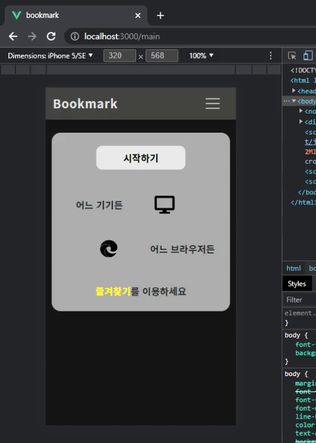|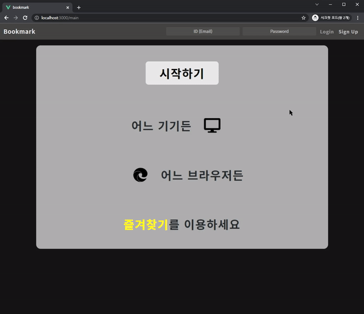|
| create User     |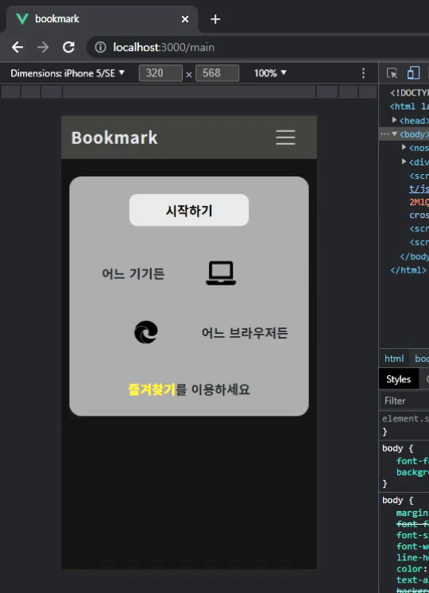|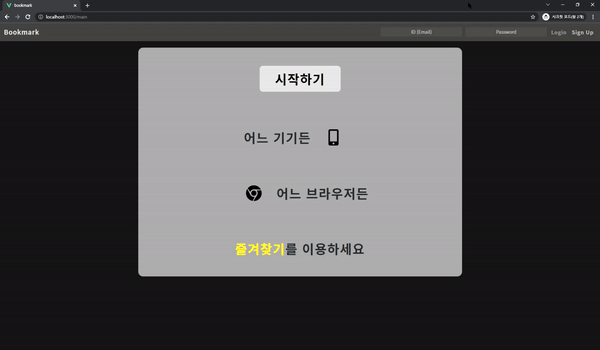|
| update User     |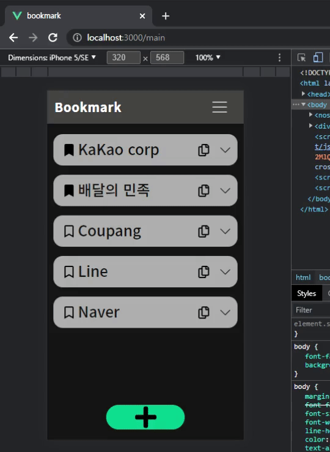|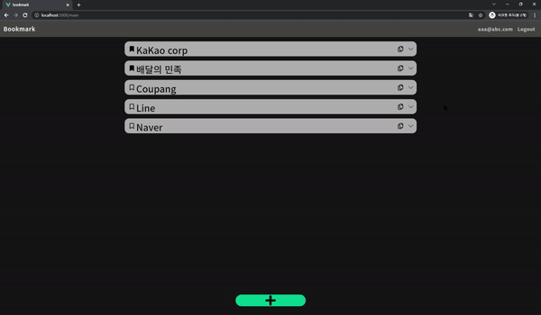|
| delete User     |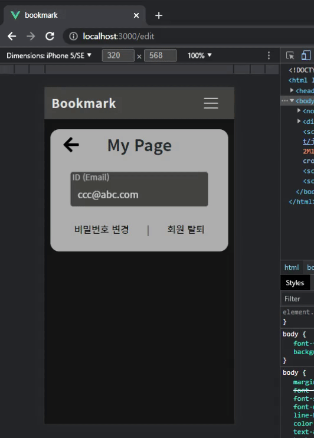|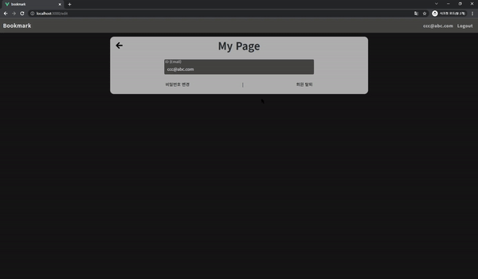|
| create Bookmark ||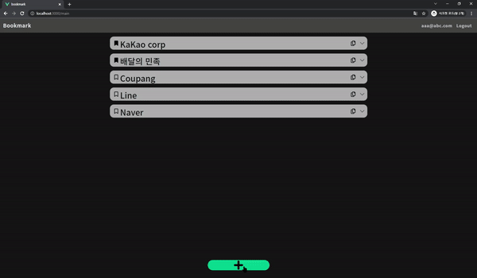|
| update Bookmark |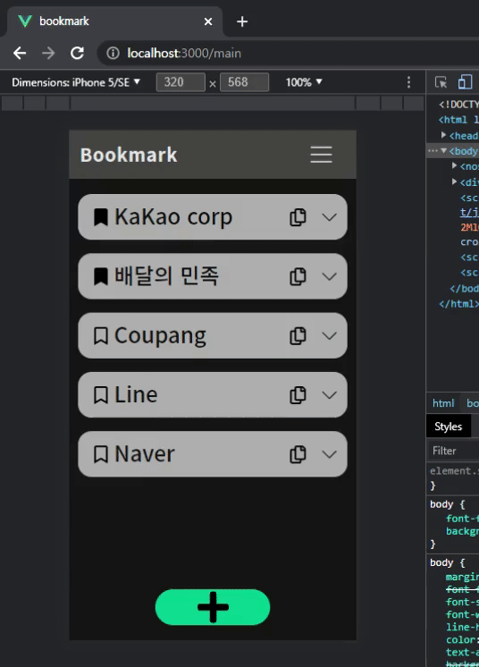|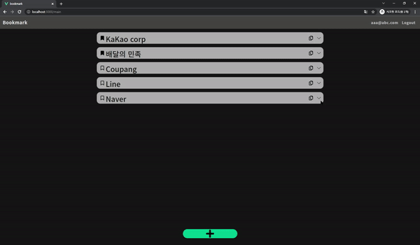|
| delete Bookmark |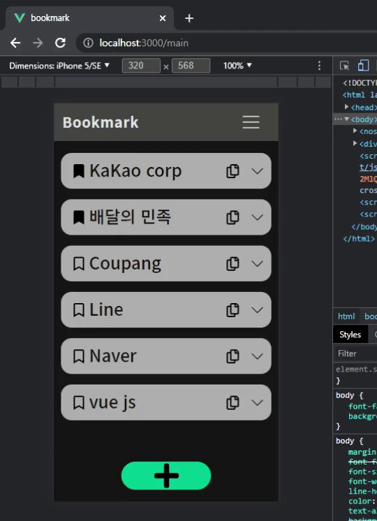|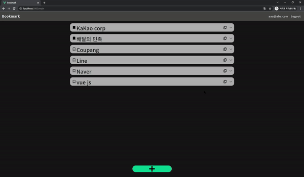|
| update Star     |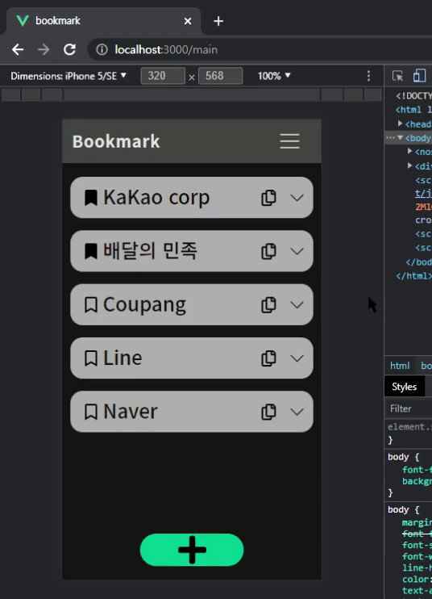|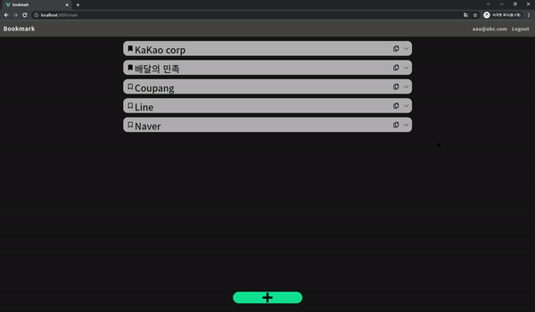|

<br>
